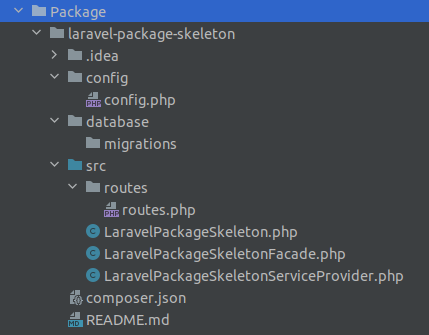

# Laravel Package Skeleton
Packages are used to add new functionality in laravel.

## How to create a laravel Package?

Create Package directory
```bash
mkdir Package
```
Create directory structure for package




## Installation

In project composer.json add
```bash
 "autoload": {
        "psr-4": {
            "App\\": "app/",
            "Database\\Factories\\": "database/factories/",
            "Database\\Seeders\\": "database/seeders/",
            "VendorName\\LaravelPackageSkeleton\\": "Package/laravel-package-skeleton/src"
        }
    },
```
config/app.php add in to  'providers' array
```
VendorName\LaravelPackageSkeleton\LaravelPackageSkeletonServiceProvider::class,
```

## Usage

```php
// Usage description here
```

### use facade

```bash
LaravelPackageSkeletonFacade::getFacadeAccessor();
```

## Credits
- [Dipesh Sukhia](https://github.com/dipeshsukhia)
